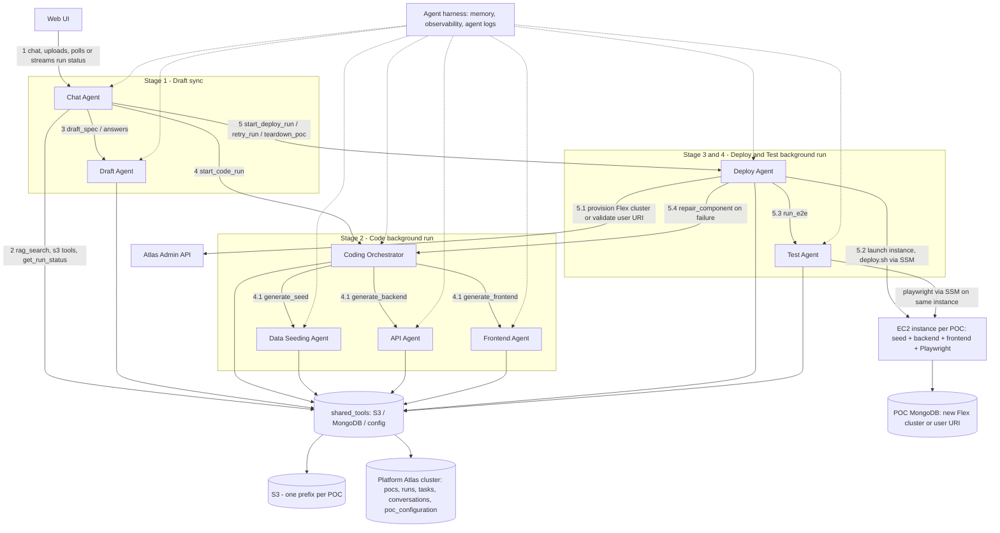
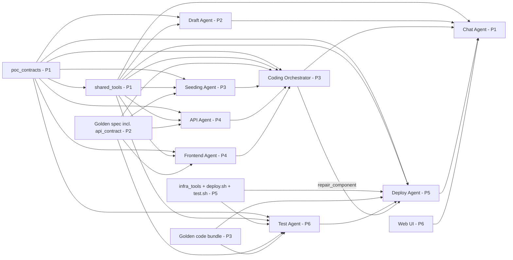

# POC Builder — Multi-Agent Platform
## High-Level Specification v1.1

| | |
|---|---|
| **Status** | Draft for team review — supersedes v1.0 |
| **Date** | 16 September 2026 |
| **Audience** | The 5–6 engineers building the agents, plus reviewers |
| **Scope** | Architecture validation, agent/tool/data contracts, cloud API mapping, team dependencies |
| **Out of scope** | Low-level design of individual agents (owned by each agent's developer); security hardening of generated code on EC2 (deferred past v1 by product-owner decision) |

**What changed from v1.0** — the product owner's 20 design decisions are incorporated throughout; Appendix A maps each decision to the section that implements it. The largest changes: the Draft Agent now produces `api_contract.yaml` so the API and Frontend agents run fully in parallel; the generated stack is fixed (React/Vite + Node.js + MongoDB) and the Deploy Agent runs one platform-owned deploy script for every POC; one EC2 instance per POC hosts backend, frontend, seeding *and* the Playwright test run; there is no Secrets Manager — the `pocs` document holds the MongoDB URI and EC2 details; `poc_definitions` on the `pocs` document is auto-embedded (Atlas Vector Search automated embedding, Voyage 4) for RAG; resources carry an `expire-on` tag consumed by the existing reaper.

---

## 0. How to read this document

Sections 1–2 describe what the platform does and the decisions this spec is built on. **Section 3 is the architecture review (Task A)**, updated with the product owner's rulings. Section 4 shows the target architecture. Section 5 defines everything shared across agents (identifiers, job model, gates, S3 layout, MongoDB collections, configuration). **Sections 6–8 are the contracts** — each developer implements their agent against these. Section 9 maps every tool to the concrete AWS / Atlas API. **Section 10 is the team plan (Task C)** with ownership, build order, and what each person can stub while waiting on others.

Contract rule: **`MUST` = cross-team interface, changed only by a spec revision; `SHOULD` = recommendation the agent owner may deviate from with a note in their README.**

---

## 1. Product overview

### 1.1 What the platform does

A user uploads a meeting transcript (or pastes requirements) and, through a chat interface, drives a pipeline that turns it into a running, tested proof-of-concept application:

| Stage | User action | Platform output | Gate |
|---|---|---|---|
| **S1 Draft** | Upload transcript; answer clarifying questions (incl. new vs existing MongoDB) | `poc_spec.md`, `schema_design.json` (with seeding requirements), `query_patterns.json`, `api_contract.yaml`, `poc_definitions` in the `pocs` document | User approves the spec |
| **S2 Code** | "Go ahead and build it" | Seeding script, backend code, frontend code — uniform layout — in S3 | User approves (or skips straight to deploy) |
| **S3 Deploy** | "Deploy it" | MongoDB database ready (new Atlas Flex cluster or user's URI), one EC2 instance running seeded backend + frontend, public IP | Automatic → S4 |
| **S4 Test** | (automatic after deploy, or on request) | Playwright end-to-end report produced on the same EC2; failures trigger bounded auto-repair; user can retry | User reviews report |
| **S5 Teardown** | "Tear it down" or `expire-on` reached (existing reaper) | EC2 terminated, new Atlas cluster deleted; S3 assets retained | — |

### 1.2 Design principles fixed by the product owner

1. **Agents-as-tools topology.** The Chat Agent is the only user-facing agent; every other agent is exposed to its caller as a tool. The Coding Orchestrator calls the Data Seeding, API, and Frontend agents as tools. Deploy failures trigger regeneration through the Coding Orchestrator's `repair_component`.
2. **S3 is the artifact store.** One S3 prefix per POC.
3. **The platform MongoDB Atlas cluster is the state store** — POC objects (including MongoDB URI, EC2 details, asset metadata, POC definitions), runs, tasks, conversations, and platform configuration. **No AWS Secrets Manager in v1.**
4. **Every generated POC is React/Vite + Node.js + MongoDB**, in a fixed repository layout, so the Deploy Agent's build-and-deploy script is identical for every app.
5. **One EC2 instance per POC** does everything: seed, build/serve backend and frontend, run Playwright.
6. **The agent harness** supplies memory (semantic / episodic / procedural) and observability (tool-call results, execution state, agent logs). No CloudWatch; POC app logs stay on the instance; SSM command output goes to S3.
7. **Expiry by tag.** EC2 instances and Atlas clusters carry `expire-on` (`mm-dd-yyyy`, default creation day + 2); an existing scheduled reaper tears down expired resources.

---

## 2. Decisions and assumptions

| # | Decision | Rationale / source |
|---|---|---|
| D1 | **Generated stack (fixed):** Node.js 20 backend (Express + Mongoose) that also serves the built frontend; React 18 + Vite + TypeScript frontend; seeding script in Node.js with the official `mongodb` driver; MongoDB database. | Product owner #8, #15. A single Node process serving `/api/*` and the static `dist/` is how "frontend calls localhost" is realised — the browser calls the public IP, the frontend uses a relative `/api` base URL, and nothing else is exposed. (Browser JavaScript cannot reach the instance's own `localhost`; the relative URL + same process achieves the intent without nginx.) |
| D2 | **Platform implemented in Python** on the team's agent harness (LangGraph-compatible), `boto3` for AWS, `requests` for the Atlas Admin API, PyMongo for the platform cluster. | Continuity with the prototype and harness. |
| D3 | **Remote execution on EC2 via AWS Systems Manager Run Command (`AWS-RunShellScript`), not SSH.** | No key-pair handling, no inbound 22, stdout/stderr captured to S3 per step. |
| D4 | **EC2 image: Ubuntu 24.04 LTS** (resolved at runtime from the Canonical public SSM parameter). | Playwright's `--with-deps` installer supports Ubuntu officially; Amazon Linux 2023 needs a hand-maintained dependency list. Ubuntu AMIs ship the SSM agent. |
| D5 | **POC database choice is collected by the Draft Agent:** `new_atlas` (platform provisions an Atlas Flex cluster in the platform's Atlas project) or `existing` (user supplies a MongoDB URI). Stored on the `pocs` document. | Product owner #16. |
| D6 | **All long-running stages are background runs** with status in the `runs` collection, polled/streamed by the UI. | Product owner #2. |
| D7 | **Secrets (MongoDB URI, DB user/password) live on the `pocs` document** in the platform cluster; the Deploy Agent reads them and exports them as environment variables on the instance via SSM. | Product owner #9, #19. (Atlas Queryable Encryption / CSFLE on those fields is a cheap v2 hardening — not in v1.) |
| D8 | **Security hardening of generated code on EC2 is out of scope for v1.** The platform still uses the VPC / subnet / security group / instance profile named in `poc_configuration` — those are environment facts, not hardening. | Product owner #6. |
| D9 | **Asset versioning:** `spec/vNNN`, `code/vNNN` folders; nothing under them is overwritten. | Repair loops regenerate code; previous versions stay diffable. |
| D10 | **Environment facts come from the `poc_configuration` collection** (VPC, subnet, security groups, IAM instance profile, AMI parameter, instance types, Atlas project ID, bucket, guardrail limits). Agents never hard-code them. | Product owner #20. |

---

## 3. Architecture review (Task A) — with product-owner rulings

The proposed architecture is sound in its core shape. The findings below were raised against the original diagram; the **Ruling** column records the product owner's decision and where this spec implements it. Severity: **H** = rework/outage risk if ignored; **M** = friction; **L** = hygiene.

| ID | Sev | Finding | Ruling and implementation |
|---|---|---|---|
| **F1** | H | Two agents owned the data-seeding script (Draft Agent tool list and a Data Seeding Agent). | **Accepted.** Draft Agent produces seeding *requirements* inside `schema_design.json`; only the Data Seeding Agent, called by the Coding Orchestrator, produces the script. No Draft → Seeding call. §6.2, §6.4 |
| **F2** | H | Synchronous tool-call chains (deploy + seed + build + Playwright ≈ 10–20 min) will exceed every timeout. | **Accepted.** Job model: Coding Orchestrator and Deploy Agent start background runs; progress in the `runs`/`tasks` collections; Chat Agent gets `get_run_status`. §5.3 |
| **F3** | H | Two agents could mutate generated code (orchestrator sub-agents and Deploy "debug" agents). | **Accepted.** Coding Orchestrator exposes `repair_component(component, failure)`; Deploy Agent calls it; Seeding/API/Frontend agents support `mode: generate \| repair`; no debug agents. §6.3, §6.9 |
| **F4** | H | No recorded human-in-the-loop gates. | **Accepted.** `pocs.approvals[] = {stage, approved_by, at, spec_version}`; stage agents `MUST` refuse to start without the preceding gate. §5.3 |
| **F5** | H | Unbounded repair loop. | **Accepted, extended.** Max 3 repair attempts per component per stage; then the run fails with a structured report **and the user gets a retry option** (`retry_run`). §5.3, §6.7 |
| **F6** | H | Security of executing LLM-generated code on EC2 (network, IAM scoping, script scanning). | **Deferred to a later version** by product-owner decision. v1 keeps only environment facts in `poc_configuration` and the expire-on reaper. Listed as tech debt in §11. |
| **F7** | M | Frontend waited on the whole backend because the API Agent produced contract + code together. | **Accepted, moved earlier.** The **Draft Agent** produces `api_contract.yaml` as part of the spec's high-level architecture; API and Frontend agents consume it in parallel. §6.2 |
| **F8** | M | Deploy Agent must be stack-agnostic while each coding agent emitted its own build script. | **Accepted, simplified.** Fixed stack + fixed repository layout + one platform-owned `deploy.sh`; coding agents emit no build scripts, only code and `package.json`. §8.6 |
| **F9** | M | Where the DB connection string flows, without writing it into code. | **Accepted, different store.** URI on the `pocs` document (no Secrets Manager); Deploy Agent exports it as `MONGODB_URI` on the instance via SSM; generated code reads env only. §5.6 |
| **F10** | M | Test Agent had nowhere to run Playwright. | **Overruled.** Playwright runs **on the POC's own EC2 instance** (one instance per POC does seed, build, serve, test). Tests target `http://localhost:80`. §6.8 |
| **F11** | M | Clarifying-question loop had no home. | **Accepted.** Draft Agent returns `needs_clarification` + `questions[]`; Chat Agent asks and re-invokes with `answers[]`; **max 5 rounds**, then draft with stated assumptions. §6.1, §6.2 |
| **F12** | M | No teardown path. | **Accepted, via existing reaper.** `expire-on` tag (`mm-dd-yyyy`, default +2 days) on EC2 and Atlas resources; the existing scheduled reaper tears them down. Deploy Agent also offers explicit `teardown_poc`. §5.7 |
| **F13** | L | "S3 tool" drawn three times. | **Accepted.** One `shared_tools` package (S3 tools, MongoDB tools, config). §7 |
| **F14** | L | RAG search over past POCs. | **Accepted, strengthened.** Chat Agent exposes `rag_search`; Draft Agent creates `poc_definitions` (summary, goal, success criteria…) on the `pocs` document, auto-embedded with Voyage 4 via Atlas Vector Search automated embedding. §5.5, §7.4 |
| **F15** | L | Frontend needs the backend URL. | **Resolved by D1.** Frontend uses relative `/api`; the backend serves the frontend build. §8.6 |

**Verdict:** proceed. All H-severity items except F6 are resolved in the contracts below; F6 is consciously deferred.

---

## 4. Target architecture



Numbering follows the original sketch (1 UI→Chat, 2 shared tools, 3 Draft, 4.x Coding, 5.x Deploy). Differences from the sketch: `api_contract.yaml` is a Draft output; seeding, API and frontend generation run in parallel; repair goes through the orchestrator; tests run on the POC instance.

### 4.1 Component inventory

| Component | Type | Owner (§10) | Called by | Calls |
|---|---|---|---|---|
| Web UI | Frontend app | P6 | user | platform API (chat, run status) |
| Chat Agent | Agent (user-facing) | P1 | UI | Draft Agent, Coding Orchestrator, Deploy Agent, Test Agent (re-run), shared_tools |
| Draft Agent | Agent (tool, sync) | P2 | Chat Agent | shared_tools |
| Coding Orchestrator | Agent (tool, background run) | P3 | Chat Agent, Deploy Agent | Seeding, API, Frontend agents; shared_tools |
| Data Seeding Agent | Agent (tool) | P3 | Coding Orchestrator | shared_tools |
| API Agent | Agent (tool) | P4 | Coding Orchestrator | shared_tools |
| Frontend Agent | Agent (tool) | P4 | Coding Orchestrator | shared_tools |
| Deploy Agent | Agent (tool, background run) | P5 | Chat Agent | infra_tools (EC2, SSM, Atlas), Test Agent, Coding Orchestrator (`repair_component`), shared_tools |
| Test Agent | Agent (tool) | P6 | Deploy Agent, Chat Agent | infra_tools (SSM), shared_tools |
| `shared_tools` package | Python package | P1 | all agents | S3, platform cluster |
| `infra_tools` package | Python package | P5 | Deploy Agent, Test Agent | EC2, SSM, Atlas Admin API |
| `deploy.sh` (platform-owned) | Shell script in S3 | P5 | Deploy Agent via SSM | — |
| Existing reaper | Scheduled job (exists) | — | scheduler | EC2, Atlas |

---

## 5. Cross-cutting design

### 5.1 Agent harness contract

Every agent `MUST`:
1. Accept and return the **AgentEnvelope** (§8.1).
2. Register its callable surface as **tools** with JSON-schema parameters so a parent can call it as a tool.
3. Use harness **memory**: *episodic* (this run's tool calls/decisions, keyed by `run_id`), *semantic* (via `rag_search` over `pocs.poc_definitions`), *procedural* (agent playbooks, e.g., repair patterns).
4. Emit **observability events** through the harness for every tool call and state transition; agent logs are the harness runtime's — no separate log sinks.
5. Propagate the **correlation IDs** (§5.2) on every call.

### 5.2 Identifiers

| ID | Format | Created by | Meaning |
|---|---|---|---|
| `poc_id` | `poc_` + ULID | Chat Agent on first upload | One POC; the S3 prefix and the `pocs` key |
| `run_id` | `run_` + ULID | The agent that starts a stage | One execution of a stage (draft, code, deploy, test, teardown) |
| `task_id` | `task_` + ULID | Any agent that delegates | One sub-agent or tool execution inside a run |
| `trace_id` | harness | harness | Observability correlation |
| `version` | `vNNN` | Producing agent | Version of `spec/` or `code/` folder |

Every envelope, S3 object metadata, and platform document carries `poc_id` and `run_id`.

### 5.3 Job model, gates, repair, retry

**Background runs.** `start_code_run`, `start_deploy_run`, `start_test_run`, `teardown_poc`, `repair_component` all: validate the request → insert a `runs` document (`status: queued`) → hand the run to the harness background executor → return `{run_id}` within 2 s. The run updates `runs.current_step` / `runs.steps[]` and inserts a `tasks` document per sub-agent or tool invocation. The UI polls `GET /pocs/{poc_id}/runs/{run_id}` or subscribes to a change stream on `runs` (server-sent events from the platform API). The Chat Agent answers "how is it going?" from `get_run_status(run_id)`.

**Gates (`MUST`).** `pocs.approvals[]` entries are `{stage, approved_by, at, spec_version, code_version?, implicit?}`.

| Run | Required approval | Recorded by |
|---|---|---|
| Code | `spec_approved` for the current `spec_version` | Chat Agent after showing the user the spec version they are approving |
| Deploy | `code_approved` for the current `code_version`, **or** `spec_approved` plus the user's explicit "deploy without reviewing code" → recorded as `code_approved` with `implicit: true` | Chat Agent |
| Test (re-run), Teardown | none | — |

A stage agent that finds the gate missing returns `status: failed, error.code = GATE_NOT_APPROVED` without creating cloud resources.

**Repair loop (`MUST`).** On a semantic failure (seed exit ≠ 0, build failure, healthcheck failure, attributable test failure), the Deploy Agent builds a `FailureReport` (§8.9), calls `repair_component`, waits for that run, then resumes its own run from the failed step with the new `code_version`. **Max 3 repair attempts per component per stage** (`runs.repair_attempts.<component>`). After the third failure the run ends `failed` with `runs.error` and a user-readable `failure_summary.md` in S3.

**User retry.** The Chat Agent offers `retry_run(run_id, options)`; options: `from_step` (default: the failed step), `reset_repair_counter: bool` (default false — the user must say so explicitly), `new_code_version?`. Retry reuses the existing instance and database when they are still alive (checked via `describe_instance`), else re-provisions.

**Resumability.** Runs record completed steps and their output references; `resume_run(run_id)` continues from the last completed step. **Idempotency:** `ClientToken = f"{poc_id}-{run_id}"` on `run_instances`; Atlas cluster name derived from `poc_id`; deterministic S3 keys.

**Concurrency.** At most one `running` run per `(poc_id, stage)` — enforced by a partial unique index on `runs`.

### 5.4 S3 layout

Bucket from `poc_configuration.aws.s3_bucket`, versioning enabled, SSE-S3. Layout (`MUST`):

```
platform/scripts/deploy.sh                 platform-owned uniform deploy script (versioned by S3)
platform/scripts/test.sh                   platform-owned uniform Playwright runner script
pocs/{poc_id}/
  input/transcript.txt                     original upload (converted to text)
  input/transcript.meta.json               filename, uploaded_by, uploaded_at, sha256
  spec/v{NNN}/
    poc_spec.md                            §8.2
    schema_design.json                     §8.3 (includes seed_requirements)
    query_patterns.json                    §8.4
    api_contract.yaml                      §8.5 — produced by the Draft Agent
    clarifications.json                    questions asked + answers (audit)
  code/v{NNN}/
    seed/                                  seed.js, package.json, SEED_README.md
    backend/                               Express app (serves /api and the frontend build)
    frontend/                              Vite app
    poc.manifest.json                      §8.6
    bundle.tar.gz                          what the instance downloads
  deploy/{run_id}/
    deployment.json                        §8.7 (also mirrored on pocs.deployment)
    logs/{step}.stdout.txt, {step}.stderr.txt   SSM command output (per D3)
  test/{run_id}/
    tests/                                 generated Playwright spec files (uploaded before the run)
    test_report.json                       §8.8
    artifacts/                             screenshots, traces (uploaded from the instance)
  repairs/{run_id}/{task_id}/failure.json, diff.patch
```

Object metadata `MUST` include `poc_id`, `run_id`, `producer`, `content_sha256`. `pocs.assets` (§5.5) is the index of "latest good" keys.

### 5.5 Platform MongoDB (Atlas) — collections

Database `poc_builder` on the pre-provisioned platform cluster. All documents carry `created_at`, `updated_at`. The platform lead owns the index/migration script.

#### `pocs` — one document per POC (index: `poc_id` unique; `owner_user_id, created_at`; `status`)

```json
{
  "poc_id": "poc_01J…", "title": "Real-time recommendation engine", "owner_user_id": "u_123",
  "status": "drafting | spec_ready | coding | code_ready | deploying | deployed | testing | tested | failed | torn_down",
  "s3_prefix": "pocs/poc_01J…/",
  "current_versions": {"spec": "v002", "code": "v003"},

  "poc_definitions": {
    "poc_summary": "Recommend products on the PDP using co-purchase signals…",
    "poc_goal": "Prove that co-purchase recommendations lift PDP click-through in a 6-week POC",
    "poc_success_criteria": "p95 recommendation latency < 300 ms with 10k products; ≥ 5 recommendations per PDP; …",
    "poc_domain": "e-commerce",
    "poc_key_entities": "products, orders, customers, recommendations",
    "poc_user_stories": "us-01 shopper sees recommendations on PDP; us-02 …"
  },

  "approvals": [{"stage": "spec_approved", "spec_version": "v002", "approved_by": "u_123", "at": "…", "implicit": false}],

  "database": {
    "mode": "new_atlas | existing",
    "connection_uri": "mongodb+srv://poc_01j:…@poc-01j.xxxx.mongodb.net/poc_01j",
    "database_name": "poc_01j",
    "atlas": {"group_id": "…", "cluster_name": "poc-01j", "region": "AP_SOUTH_1", "db_username": "poc_01j", "db_password": "…", "state": "IDLE", "expire_on": "09-18-2026"},
    "provided_by_user": false, "validated_at": "…"
  },

  "ec2": {"instance_id": "i-…", "instance_type": "t3.medium", "region": "ap-south-1", "public_ip": "…", "public_dns": "…",
          "ami_id": "ami-…", "state": "running", "launched_at": "…", "expire_on": "09-18-2026", "app_url": "http://<ip>/"},

  "assets": {
    "transcript": "pocs/…/input/transcript.txt",
    "spec": {"version": "v002", "poc_spec": "pocs/…/spec/v002/poc_spec.md", "schema_design": "…", "query_patterns": "…", "api_contract": "pocs/…/spec/v002/api_contract.yaml"},
    "code": {"version": "v003", "seed": "pocs/…/code/v003/seed/", "backend": "pocs/…/code/v003/backend/", "frontend": "pocs/…/code/v003/frontend/", "bundle": "pocs/…/code/v003/bundle.tar.gz", "bundle_sha256": "…"},
    "deployment": "pocs/…/deploy/run_…/deployment.json",
    "test_report": "pocs/…/test/run_…/test_report.json"
  },

  "last_runs": {"draft": "run_…", "code": "run_…", "deploy": "run_…", "test": "run_…"},
  "last_test": {"run_id": "run_…", "passed": 11, "failed": 1, "not_automatable": 1},
  "tags": ["recommendation", "ecommerce"]
}
```

**Vector index on `pocs` (automated embedding, Voyage 4).** Index name `poc_definitions_vidx`:

```json
{
  "fields": [
    {"type": "autoEmbed", "modality": "text", "path": "poc_definitions.poc_summary", "model": "voyage-4"},
    {"type": "autoEmbed", "modality": "text", "path": "poc_definitions.poc_goal", "model": "voyage-4"},
    {"type": "autoEmbed", "modality": "text", "path": "poc_definitions.poc_success_criteria", "model": "voyage-4"},
    {"type": "filter", "path": "owner_user_id"},
    {"type": "filter", "path": "status"},
    {"type": "filter", "path": "poc_definitions.poc_domain"}
  ]
}
```

Atlas generates and stores the embeddings; no `embedding` array is written by agents. Queries use `$vectorSearch` with `query: "<text>"` (§7.4). Automated embedding is a preview feature at time of writing — acceptable for this internal platform; if it is unavailable on the platform cluster, the fallback is a `poc_definitions.embedding` array written by `shared_tools.mongo.upsert_poc_definitions` using the Voyage API directly (same index shape with `type: vector`).

**Secrets on this document.** `database.connection_uri`, `database.atlas.db_password` are stored in clear in v1 by decision D7. The UI `MUST` mask them; the platform API `MUST NOT` return them to the browser; the Chat Agent `MUST NOT` echo them into conversation or LLM prompts (shared tool `get_poc(poc_id, include_secrets=False)` is the default).

#### `runs` — one per stage execution (index: `run_id` unique; `poc_id, started_at`; partial unique `(poc_id, stage)` where `status = "running"`)

```json
{"run_id": "run_…", "poc_id": "poc_…", "stage": "draft | code | deploy | test | teardown | repair",
 "status": "queued | running | succeeded | failed | cancelled",
 "requested_by": "u_123", "started_by_agent": "chat_agent", "parent_run_id": null,
 "inputs": {"code_version": "v003", "from_step": null},
 "current_step": "build_frontend", "progress_pct": 60,
 "steps": [{"name": "provision_db", "status": "succeeded", "started_at": "…", "ended_at": "…", "log_key": "…", "output": {"cluster_name": "poc-01j"}}],
 "repair_attempts": {"frontend": 2, "backend": 0, "seed": 0},
 "error": {"code": "BUILD_FAILED", "component": "frontend", "message": "…", "failure_key": "pocs/…/failure.json", "summary_key": "pocs/…/failure_summary.md", "retry_allowed": true},
 "outputs": {"deployment_key": "…", "test_report_key": "…"},
 "started_at": "…", "ended_at": "…", "trace_id": "…"}
```

#### `tasks` — one per sub-agent/tool invocation (index: `run_id, seq`; `task_id` unique)

```json
{"task_id": "task_…", "run_id": "run_…", "poc_id": "poc_…", "seq": 7, "agent": "api_agent", "tool": "generate_backend", "mode": "repair",
 "status": "queued | running | succeeded | failed", "input_ref": "…", "output_ref": "pocs/…/code/v004/backend/",
 "duration_ms": 48211, "token_usage": {"input": 18211, "output": 6120}, "started_at": "…", "ended_at": "…"}
```

#### `conversations` — chat history per POC (index: `poc_id, seq`)

`{poc_id, seq, role: user|assistant|tool, content, tool_calls[], run_id?, created_at}`.

#### `poc_configuration` — environment facts (index: `config_id` unique; one document `config_id: "default"`, optional per-environment overrides)

```json
{"config_id": "default", "environment": "dev",
 "aws": {"region": "ap-south-1", "s3_bucket": "poc-builder-assets-dev", "vpc_id": "vpc-…", "subnet_id": "subnet-…",
         "security_group_ids": ["sg-…"], "instance_profile_name": "poc-instance-role",
         "ami_ssm_parameter": "/aws/service/canonical/ubuntu/server/24.04/stable/current/amd64/hvm/ebs-gp3/ami-id",
         "allowed_instance_types": ["t3.small", "t3.medium", "t3.large"], "default_instance_type": "t3.medium",
         "root_volume_gb": 30, "deploy_script_key": "platform/scripts/deploy.sh", "test_script_key": "platform/scripts/test.sh"},
 "atlas": {"group_id": "<project id for POC clusters>", "default_region": "AP_SOUTH_1", "backing_provider": "AWS",
           "service_account": {"client_id": "…", "client_secret": "…"}},
 "guardrails": {"seed_max_docs_per_collection": 10000, "seed_max_docs_hard_cap": 100000, "bundle_max_mb": 50,
                "max_repair_attempts": 3, "max_clarification_rounds": 5, "expire_days": 2,
                "run_timeouts_s": {"code": 1800, "deploy": 2400, "test": 900}, "llm_max_tokens_per_run": 2000000},
 "expire_on_format": "MM-DD-YYYY",
 "iam": {"platform_role_arn": "arn:aws:iam::…:role/poc-builder-platform", "notes": "instance profile needs SSM core + s3 get/put on pocs/*"}}
```

`shared_tools.config.get_config()` caches this for 60 s. Changing a value never requires a code change.

### 5.6 Configuration and secrets flow (v1, no Secrets Manager)

1. Deploy Agent step `provision_db` writes `pocs.database` (URI, user, password, cluster name).
2. Step `launch_instance` writes `pocs.ec2`.
3. Step `run_deploy_script` reads `pocs.database.connection_uri` and builds the SSM command with an `export` preamble — `MONGODB_URI`, `DB_NAME`, `PORT=80`, `SEED_MAX_DOCS`, `POC_ID`, `CODE_VERSION`, `BUNDLE_KEY` — and writes the same values to `/etc/poc/env` on the instance (mode 600) so `pm2` restarts pick them up.
4. Generated code reads configuration **only from environment variables**; the API and Seeding agents' prompts forbid literal connection strings.

### 5.7 Expiry and teardown

- **Tag (`MUST`):** every EC2 instance (`create_tags`) and every Atlas Flex cluster created by the platform (`tags` in the create body) carries `expire-on` = `MM-DD-YYYY` (e.g., `09-18-2026`), default = creation date + `guardrails.expire_days` (2). Also tagged: `poc_id`, `managed-by=poc-builder`.
- The **existing scheduled reaper** tears down expired resources. This spec does not build a reaper.
- `teardown_poc(poc_id)` (Deploy Agent) is the explicit path: terminate the instance; delete the platform-created Flex cluster (never touch a user-provided database); set `pocs.status = torn_down`, `pocs.ec2.state = terminated`, `pocs.database.atlas.state = deleted`. S3 assets are kept.
- `extend_expiry(poc_id, days)` (Deploy Agent) re-tags both resources — used when a user asks for more time.

### 5.8 Observability and logs

Harness observability covers agent state, tool calls, and agent logs. Platform additions: SSM stdout/stderr per step → `deploy/{run_id}/logs/` and `test/{run_id}/`; `runs.steps[]` timings; `tasks.token_usage`. POC application logs (`pm2 logs`) stay on the instance; the Deploy Agent's `fetch_app_logs(poc_id, lines)` tool pulls the tail via SSM when the user or a repair needs it. No CloudWatch.

---

## 6. Agent specifications

Each agent: purpose, owner, entry points, tools used, inputs/outputs, side effects, failure behaviour, acceptance criteria. Low-level design belongs to the owner.

### 6.1 Chat Agent

**Purpose.** The only user-facing agent. Owns the conversation, the gates, run status reporting, and mapping user intent to stage runs. Never generates specs or code itself.

**Owner:** P1. **Called by:** Web UI via platform API. **Calls:** Draft Agent, Coding Orchestrator, Deploy Agent, Test Agent, shared_tools.

**Platform API surface (owned with the agent):**

| Endpoint | Purpose |
|---|---|
| `POST /pocs` (multipart transcript or text) | creates `pocs` doc, writes `input/`, starts the draft |
| `POST /pocs/{poc_id}/messages` | user message → assistant reply (+ `run_id` if a run was started) |
| `GET /pocs/{poc_id}` | POC view (secrets masked) |
| `GET /pocs/{poc_id}/runs/{run_id}` and `GET …/runs/{run_id}/events` (SSE) | run status for the UI |

**Tools (`MUST` expose exactly these to the LLM):**

| Tool | Provided by | Purpose |
|---|---|---|
| `draft_spec(poc_id, answers?, template_poc_id?, force_assumptions?)` | Draft Agent | create/refine spec (sync) |
| `rag_search(query, k=5, filters?)` | shared_tools.rag | find semantically similar POCs (`pocs.poc_definitions`) — offered as templates and to avoid duplicate work |
| `get_poc(poc_id)` | shared_tools.mongo | POC state, versions, approvals (secrets masked) |
| `record_approval(poc_id, stage, version, implicit=false)` | shared_tools.mongo | HITL gate |
| `start_code_run(poc_id, spec_version)` | Coding Orchestrator | Stage 2 (background) |
| `start_deploy_run(poc_id, code_version, options)` | Deploy Agent | Stage 3+4 (background) |
| `start_test_run(poc_id, scope?)` | Test Agent | re-run tests on the live deployment |
| `get_run_status(run_id)` / `list_runs(poc_id)` | shared_tools.mongo | progress, step, error, retry_allowed |
| `retry_run(run_id, options)` / `cancel_run(run_id)` | Deploy Agent / Coding Orchestrator | user retry after a failed run |
| `teardown_poc(poc_id)` / `extend_expiry(poc_id, days)` | Deploy Agent | Stage 5 |
| `s3_list(prefix)` / `s3_get_text(key)` / `s3_presign(key)` | shared_tools.s3 | show or link artifacts |

**Behaviour (`MUST`):** on upload, run `rag_search` on the transcript's first 2 000 characters and mention close matches (score ≥ 0.8) before drafting; drive the clarification loop up to `guardrails.max_clarification_rounds` (5), then call `draft_spec(force_assumptions=true)`; ask the user about the POC database (new vs existing URI) if the Draft Agent lists it among its questions; record approvals only after presenting the version being approved; refuse to start a stage whose gate is missing and say what is missing; never start a second run of the same stage while one is running; on `runs.status = failed`, present `failure_summary.md` and offer retry / tear down / manual fix; store every message in `conversations`.

**Acceptance.** A scripted conversation fixture drives upload → 2 clarification rounds (including the database choice) → approval → code run → deploy run → test report → a failed run with retry → teardown, with every gate in `pocs.approvals` and no out-of-order stage.

### 6.2 Draft Agent

**Purpose.** Turn a transcript into an approval-ready POC specification and the design artifacts the coding stage needs: schema design with seeding requirements, query patterns, the **API contract**, and the `poc_definitions` object for RAG.

**Owner:** P2. **Called by:** Chat Agent (sync). **Calls:** shared_tools (S3, mongo, rag).

**Entry point:** `draft_spec(poc_id, answers?: [{question_id, answer}], template_poc_id?, force_assumptions?: bool)`

**Internal tools (listed for dependency clarity; design is the owner's):**

| Tool | Output |
|---|---|
| `extract_requirements(transcript)` | structured requirement fields |
| `analyze_completeness(fields)` | missing fields, completeness % |
| `generate_questions(missing, context)` | `questions[]` (≤ 5 per round). **`MUST` include a `database_choice` question** whenever `pocs.database.mode` is unset: "Create a new MongoDB Atlas cluster for this POC, or use an existing MongoDB instance? (If existing, paste the connection URI.)" |
| `design_schema(fields)` | `schema_design.json` incl. `seed_requirements` (§8.3) |
| `design_query_patterns(fields, schema)` | `query_patterns.json` (§8.4) |
| `design_api_contract(fields, schema, patterns)` | `api_contract.yaml` (§8.5) — the high-level architecture section of the spec links to it |
| `render_spec(...)` | `poc_spec.md` (§8.2) |
| `create_poc_definitions(fields)` | `poc_definitions` object → `shared_tools.mongo.upsert_poc_definitions` (auto-embedded by Atlas) |
| `record_database_choice(answer)` | `pocs.database = {mode: new_atlas}` or `{mode: existing, connection_uri, provided_by_user: true}` |

**Outputs:** `status: needs_clarification` with `questions: [{question_id, field, question, why_it_matters, suggestions[], kind: text|choice, choices?}]`, **or** `status: drafted` with `spec_version`, the S3 keys of the five spec artifacts, `assumptions[]`, and `poc_definitions`.

**Required before drafting** (else ask, unless `force_assumptions`): title; business objective; target users; 3–7 user stories; measurable success criteria; data entities with rough volumes; timeline/constraints; **database choice**. Optional: integrations, NFRs, out-of-scope.

**Side effects:** `spec/v{NNN}/*`; `pocs.current_versions.spec`, `pocs.assets.spec`, `pocs.poc_definitions`, `pocs.database.mode` (+ URI if existing), `pocs.status = spec_ready`; `clarifications.json`.

**Failure behaviour:** empty/unreadable transcript → `INVALID_TRANSCRIPT`; contract or schema fails validation → one retry with validator errors, then `failed`.

**Acceptance.** `fixtures/transcripts/recsys_meeting.txt` → all five artifacts validate; the contract has one operation per user story at minimum; `poc_definitions` non-empty. `fixtures/transcripts/vague_meeting.txt` → `needs_clarification` containing success criteria, data entities and `database_choice`.

### 6.3 Coding Orchestrator Agent

**Purpose.** Stage 2: run the three coding agents in parallel from the spec artifacts, assemble the versioned bundle, and expose the single repair entry point.

**Owner:** P3. **Called by:** Chat Agent (`start_code_run`), Deploy Agent (`repair_component`). **Calls:** Data Seeding, API, Frontend agents; shared_tools.

**Entry points:**

| Tool | Returns |
|---|---|
| `start_code_run(poc_id, spec_version)` | `{run_id}` (background) |
| `repair_component(poc_id, code_version, component: seed\|backend\|frontend, failure: FailureReport)` | `{run_id}` (background, `stage: repair`); on success `code/v{NNN+1}/` with only that component changed and a new `poc.manifest.json`; `pocs.current_versions.code` advanced |
| `get_code_bundle(poc_id, code_version)` | bundle key, sha256, manifest |
| `cancel_run(run_id)` | — |

**Run steps (`MUST`):** `check_gate` (`spec_approved`) → `load_inputs` (spec, schema, query patterns, contract) → **in parallel** `generate_seed`, `generate_backend`, `generate_frontend` (each a `tasks` doc) → `validate_layout` (fixed layout §8.6, `package.json` present, no literal `mongodb+srv://`, bundle ≤ `bundle_max_mb`, seed volumes ≤ caps) → `assemble_bundle` (`poc.manifest.json`, `bundle.tar.gz`) → `finalize` (`pocs.current_versions.code`, `pocs.assets.code`, `pocs.status = code_ready`).

**Repair run:** load failing version → call the component's agent with `mode: repair`, the `FailureReport`, and the current source → `validate_layout` → new version folder (other components copied forward unchanged) → finalize. A repair `MUST NOT` change `api_contract.yaml`; if `failure_class = CONTRACT_MISMATCH`, the orchestrator regenerates **both** backend and frontend against the unchanged contract.

**Acceptance.** From the golden spec, produces a bundle that `deploy.sh` builds cleanly in a local Ubuntu container; a repair request with a synthetic frontend TypeScript error yields v+1 with only `frontend/` changed.

### 6.4 Data Seeding Agent

**Purpose.** Generate a deterministic, cap-respecting seeding script matching `schema_design.json` and supporting every query pattern.

**Owner:** P3. **Called by:** Coding Orchestrator only. **Calls:** shared_tools.

**Entry point:** `generate_seed(poc_id, code_version, mode: generate|repair, inputs: {schema_design_key, query_patterns_key}, failure?, previous_source_key?)`

**Output:** `code/v{NNN}/seed/` — `seed.js` (Node 20, `mongodb` driver), `package.json`, `SEED_README.md`.

**Behaviour (`MUST`):** read `MONGODB_URI`, `DB_NAME`, `SEED_MAX_DOCS` from env; idempotent (drop and recreate the POC's collections); create declared indexes; obey per-collection volumes from `seed_requirements` capped by `SEED_MAX_DOCS`; fixed random seed; print a final JSON line `{"seed_summary": {"<collection>": n}}` (parsed by `deploy.sh`); exit non-zero on failure.

**Acceptance.** Against a local MongoDB the golden-spec script seeds within caps in < 60 s, creates all indexes, and is reproducible.

### 6.5 API Agent

**Purpose.** Implement the Draft Agent's API contract as a Node.js backend against MongoDB using the query patterns, and serve the frontend build.

**Owner:** P4. **Called by:** Coding Orchestrator only. **Calls:** shared_tools.

**Entry point:** `generate_backend(poc_id, code_version, mode: generate|repair, inputs: {spec_key, schema_design_key, query_patterns_key, api_contract_key}, failure?, previous_source_key?)`

**Output:** `code/v{NNN}/backend/` — Express + Mongoose, routes per contract `operationId`, `package.json` (scripts `build`, `start`), `.env.example`, `BACKEND_README.md`.

**Behaviour (`MUST`):** listen on `PORT` (deploy sets 80); routes under `/api`; `GET /api/health` → `{status:"ok", db:"connected"}` only after a DB round-trip; serve static files from `STATIC_DIR` (deploy sets `/opt/poc/frontend/dist`) with SPA fallback to `index.html` for non-`/api` paths; read `MONGODB_URI`/`DB_NAME` from env; JSON errors `{error:{code,message}}`; request logging to stdout; no authentication in v1.

**Acceptance.** Builds and starts against a seeded local MongoDB; the contract-driven smoke tests generated by the Test Agent's library pass.

### 6.6 Frontend Agent

**Purpose.** Produce a React/Vite frontend demonstrating the spec's user stories using only the API contract.

**Owner:** P4. **Called by:** Coding Orchestrator only. **Calls:** shared_tools.

**Entry point:** `generate_frontend(poc_id, code_version, mode: generate|repair, inputs: {spec_key, api_contract_key}, failure?, previous_source_key?)`

**Output:** `code/v{NNN}/frontend/` — Vite + React 18 + TypeScript; `src/api/client.ts` generated from the contract with base URL `/api` (relative — same origin as the backend that serves it); one route per user story; `package.json` (script `build` → `dist/`); `FRONTEND_README.md`.

**Behaviour (`MUST`):** relative API base URL; `data-testid` attributes named by user-story ID (`us-01-…`) as declared in the spec; no SSR; no environment variables required at build time.

**Acceptance.** `npm ci && npm run build` succeeds in a clean container; every golden user story has a route and its declared `data-testid`s appear in `dist/`.

### 6.7 Deploy Agent

**Purpose.** Stages 3–5: prepare the POC database, launch the POC's EC2 instance, run the uniform deploy script via SSM, hand off to the Test Agent, drive repairs and retries, tear down.

**Owner:** P5. **Called by:** Chat Agent. **Calls:** infra_tools (EC2, SSM, Atlas), Test Agent, Coding Orchestrator (`repair_component`), shared_tools.

**Entry points:**

| Tool | Returns |
|---|---|
| `start_deploy_run(poc_id, code_version, options: {instance_type?, run_tests?: true, expire_days?})` | `{run_id}` |
| `retry_run(run_id, options: {from_step?, reset_repair_counter?: false, new_code_version?})` | `{run_id}` (new run, `parent_run_id` set) |
| `resume_run(run_id)` | continues after a repair |
| `teardown_poc(poc_id)` / `extend_expiry(poc_id, days)` | `{run_id}` / `{expire_on}` |
| `get_deployment(poc_id)` / `fetch_app_logs(poc_id, lines=200)` | `deployment.json` / pm2 log tail |

**Run steps (`MUST`, each a `runs.steps[]` entry with SSM logs in S3):**

| # | Step | Tools | Success condition |
|---|---|---|---|
| 1 | `check_gate` | mongo | `code_approved` for `code_version` |
| 2 | `provision_db` | `atlas.create_flex_cluster` (mode `new_atlas`) **or** `atlas.validate_uri` (mode `existing`: connect, `ping`, check write permission on `DB_NAME`) | `pocs.database` complete; cluster tagged `expire-on` |
| 3 | `launch_instance` | `ec2.launch_poc_instance` | instance `running`, SSM `PingStatus = Online`, public IP; `pocs.ec2` written; tagged `expire-on` |
| 4 | `allow_instance_ip` | `atlas.allow_ip` (only for `new_atlas`; for `existing` the user is told the IP to allow-list, and the step waits for a successful `ping` up to 10 min) | DB reachable from the instance (`mongosh --eval ping` via SSM) |
| 5 | `run_deploy_script` | `ssm.run_script` → `platform/scripts/deploy.sh` with env from §5.6 | script phases `fetch`, `seed`, `build_backend`, `build_frontend`, `start`, `healthcheck` all exit 0; each phase's marker line parsed into sub-step status |
| 6 | `write_deployment` | s3 + mongo | `deployment.json`; `pocs.assets.deployment`, `pocs.ec2.app_url`, `pocs.status = deployed` |
| 7 | `run_tests` (if `run_tests`) | Test Agent `run_e2e` | report written |
| 8 | `finalize` | mongo | `runs.status = succeeded`; `pocs.status = tested` or `deployed` |

**Failure handling (`MUST`):** a failing `deploy.sh` phase maps to a component (`seed` → seed; `build_backend`/`start`/`healthcheck` → backend; `build_frontend` → frontend). Build a `FailureReport` from the phase's stderr, call `repair_component`, wait, `resume_run` from step 5 with `DEPLOY_PHASES=<failed phase and later>` so completed phases are not repeated. Test failures with `suspected_component ≠ unknown` follow the same path; `unknown` ends the run. Max 3 repairs per component (§5.3). After that, or after infrastructure failures survive backoff (5 attempts), the run ends `failed` with `runs.error.retry_allowed = true`, `failure_summary.md` written, and the instance/database left up until `expire-on` so the user can inspect or retry.

**Teardown (`MUST`):** per §5.7. Never delete a user-provided database.

**Acceptance.** With the golden code bundle (no coding agents), a `new_atlas` deploy reaches step 6 in under 15 minutes (Flex provisioning dominates) and an `existing` deploy in under 8; `retry_run` on a run failed at `build_frontend` resumes from that phase; `teardown_poc` terminates the instance and deletes the cluster.

### 6.8 Test Agent

**Purpose.** Validate the deployed POC end to end with Playwright **on the POC's EC2 instance**, against the spec's user stories and success criteria, and produce a report a human can read and the repair loop can act on.

**Owner:** P6. **Called by:** Deploy Agent, Chat Agent. **Calls:** infra_tools (SSM), shared_tools.

**Entry point:** `run_e2e(poc_id, scope?: all|smoke|user_story_ids[])` → `{run_id}` (background, `stage: test`).

**Process (`MUST`):** read `pocs.ec2`, spec, contract → generate `test_plan.json` (one API smoke test per contract operation; one browser journey per user story using its `data-testid`s; one check per automatable success criterion, e.g., latency) → generate Playwright spec files → upload to `test/{run_id}/tests/` → `ssm.run_script` → `platform/scripts/test.sh` (downloads the tests, runs `npx playwright test --reporter=json` with `BASE_URL=http://localhost:80`, uploads `results.json`, screenshots and traces to `test/{run_id}/…` with the AWS CLI on the instance) → parse into `test_report.json` (§8.8) → `pocs.last_test`, `pocs.assets.test_report`.

**Behaviour (`MUST`):** never modify the deployment; time-box (`run_timeouts_s.test`, 900 s); attribute each failure to `suspected_component` with evidence (console errors, failed requests, HTTP status); mark non-automatable success criteria `not_automatable`, not failed. Playwright and Chromium are installed once by `deploy.sh` (phase `tooling`), not per test run.

**Acceptance.** Against the golden deployment, all smoke tests pass; a deliberately broken `data-testid` yields a failure attributed to `frontend` with a screenshot in S3.

### 6.9 Repair mode (Seeding, API, Frontend agents)

Common contract for `mode: repair`: inputs are the `FailureReport`, the previous version's source key, and the unchanged spec artifacts; the agent fixes only what the failure indicates; keeps the public surface unchanged (contract, env variable names, layout, `data-testid`s, `/api/health`); writes `REPAIR_NOTES.md` in the new component folder; `SHOULD` store successful fix patterns in harness procedural memory keyed by failure signature.

---

## 7. Shared packages

### 7.1 `shared_tools.s3` (owner P1)

| Tool | Signature | boto3 |
|---|---|---|
| `put_object` | `(poc_id, run_id, key, body, content_type, producer) -> {key, version_id, sha256}` | `put_object(Bucket, Key, Body, ContentType, Metadata={poc_id, run_id, producer, content_sha256}, ServerSideEncryption='AES256')`; key `MUST` start with `pocs/{poc_id}/` or `platform/` |
| `get_object` / `get_text` | `(key) -> {body, metadata, version_id}` | `get_object` |
| `head_object` | `(key) -> metadata` | `head_object` — returns the S3 object metadata (`ETag`, `VersionId`, size, custom metadata) |
| `list_prefix` | `(prefix) -> [{key, size, last_modified}]` | `list_objects_v2` (paginated) |
| `copy_prefix` | `(src_prefix, dst_prefix)` | `copy_object` per key — forks a version folder |
| `presign_get` | `(key, expires=900) -> url` | `generate_presigned_url('get_object')` |
| `upload_dir` / `download_dir` | `(local_dir, prefix)` | `upload_file` / `download_file` |
| `make_bundle` | `(poc_id, code_version) -> {bundle_key, sha256}` | tar + `put_object` |
| `next_version` | `(poc_id, kind: spec\|code) -> 'vNNN'` | `list_objects_v2` with `Delimiter='/'` |

### 7.2 `shared_tools.mongo` (owner P1) — PyMongo against the platform cluster

| Tool | Purpose |
|---|---|
| `create_poc(owner_user_id, title, transcript_key) -> poc_id` | new `pocs` doc, `status: drafting` |
| `get_poc(poc_id, include_secrets=False)` | fetch POC object (URI/password masked unless `include_secrets`) |
| `update_poc(poc_id, set: dict)` / `update_poc_status(poc_id, status)` | `$set` with `updated_at` |
| `set_assets(poc_id, path, value)` / `set_current_version(poc_id, kind, version)` | asset metadata index |
| `upsert_poc_definitions(poc_id, definitions)` | writes `poc_definitions` (Atlas auto-embeds) |
| `record_approval(poc_id, stage, version, approved_by, implicit=False)` / `check_gate(poc_id, stage) -> bool` | gates |
| `create_run(poc_id, stage, requested_by, inputs, parent_run_id=None) -> run_id` | enforces one running run per `(poc_id, stage)` |
| `update_run_step(run_id, step, status, output=None, log_key=None)` / `set_run_progress` / `finish_run(run_id, status, error=None, outputs=None)` | run progress |
| `get_run_status(run_id)` / `list_runs(poc_id, stage=None)` | status for Chat Agent and UI |
| `increment_repair_attempt(run_id, component) -> int` | bounded repair |
| `create_task(...)` / `finish_task(...)` | sub-agent/tool invocations |
| `append_message(poc_id, role, content, tool_calls=None, run_id=None)` | conversations |
| `get_asset_metadata(poc_id, asset_path) -> {key, s3_metadata}` | joins `pocs.assets` with `s3.head_object` |

### 7.3 `shared_tools.config` (owner P1)

`get_config(config_id="default") -> dict` (60 s cache); `get_guardrail(name)`; `expire_on(days=None) -> "MM-DD-YYYY"` (uses `guardrails.expire_days` when `days` is `None`).

### 7.4 `shared_tools.rag` (owner P2)

`rag_search(query, k=5, filters: {owner_user_id?, domain?, status?}) -> [{poc_id, title, score, poc_summary, poc_goal, matched_field}]` — runs three `$vectorSearch` stages (one per auto-embedded path) unioned with `$unionWith`, or a single search on `poc_definitions.poc_summary` for v1 simplicity:

```json
[{"$vectorSearch": {"index": "poc_definitions_vidx", "path": "poc_definitions.poc_summary",
                    "query": "<user text>", "model": "voyage-4", "numCandidates": 100, "limit": 5,
                    "filter": {"owner_user_id": "u_123"}}},
 {"$project": {"poc_id": 1, "title": 1, "poc_definitions": 1, "score": {"$meta": "vectorSearchScore"}}}]
```

`index_poc(poc_id)` is a no-op under automated embedding (kept for the manual-embedding fallback in §5.5).

### 7.5 `infra_tools.ec2` (owner P5)

| Tool | AWS calls |
|---|---|
| `resolve_ami(cfg)` | `ssm.get_parameter(Name=cfg.aws.ami_ssm_parameter)` |
| `launch_poc_instance(poc_id, run_id, instance_type, expire_on) -> {instance_id, public_ip, public_dns, ami_id}` | `ec2.run_instances(ImageId, InstanceType, MinCount=1, MaxCount=1, SubnetId, SecurityGroupIds, IamInstanceProfile={'Name': cfg.aws.instance_profile_name}, BlockDeviceMappings=[root gp3 30 GB], UserData=<bootstrap>, ClientToken=f'{poc_id}-{run_id}', TagSpecifications=[{'ResourceType':'instance','Tags':[{poc_id},{'managed-by':'poc-builder'},{'expire-on': expire_on},{'Name': f'poc-{poc_id}'}]}])` → waiter `instance_running` → `describe_instances` (public IP) → waiter `instance_status_ok` → poll `ssm.describe_instance_information(Filters=[{'Key':'InstanceIds','Values':[id]}])` until `PingStatus == 'Online'` |
| `describe_instance(instance_id)` / `terminate_instance(instance_id)` / `tag_instance(instance_id, tags)` | `describe_instances` / `terminate_instances` + waiter `instance_terminated` / `create_tags` |

**Bootstrap (`user_data`) does only environment prep:** `apt-get update`, install `unzip curl awscli` (or the AWS CLI v2 bundle), Node 20 (NodeSource), `pm2`; ensure `snap amazon-ssm-agent` is active; `mkdir -p /opt/poc /etc/poc`. Everything app-specific happens in `deploy.sh` via SSM so failures are attributable to a step.

### 7.6 `infra_tools.ssm` (owner P5)

| Tool | AWS calls |
|---|---|
| `run_script(instance_id, poc_id, run_id, step, commands: [str], env: dict, timeout_s=1800) -> {status, exit_code, stdout, stderr, stdout_key, stderr_key, duration_ms}` | `ssm.send_command(InstanceIds=[id], DocumentName='AWS-RunShellScript', Parameters={'commands': ['set -o pipefail', *[f'export {k}={shlex.quote(v)}' for k,v in env.items()], *commands], 'executionTimeout': [str(timeout_s)]}, TimeoutSeconds=600, OutputS3BucketName=bucket, OutputS3KeyPrefix=f'pocs/{poc_id}/deploy/{run_id}/logs/{step}', Comment=f'{poc_id} {run_id} {step}')` → poll `get_command_invocation(CommandId, InstanceId)` every 5 s until `Status ∈ {Success, Failed, TimedOut, Cancelled}`; `ResponseCode` = exit code; `StandardOutputContent`/`StandardErrorContent` hold the first 24 000 / 8 000 chars, full text at the S3 prefix |
| `run_platform_script(instance_id, poc_id, run_id, step, script_key, env)` | `aws s3 cp s3://…/{script_key} /opt/poc/{name} && bash /opt/poc/{name}` via `run_script` |
| `cancel(command_id)` | `ssm.cancel_command` |

### 7.7 `infra_tools.atlas` (owner P5) — Atlas Administration API v2

Base `https://cloud.mongodb.com/api/atlas/v2`, header `Accept: application/vnd.atlas.2024-11-13+json`, auth via Service Account OAuth 2 client credentials (`POST https://cloud.mongodb.com/api/oauth/token`, then `Authorization: Bearer …`); `groupId = cfg.atlas.group_id`.

| Tool | Calls |
|---|---|
| `create_flex_cluster(poc_id, region, expire_on) -> {cluster_name, connection_uri, db_username, db_password}` | `POST /groups/{groupId}/flexClusters` body `{name: 'poc-<short id>', providerSettings: {backingProviderName: 'AWS', regionName: region}, terminationProtectionEnabled: false, tags: [{key:'poc_id', value}, {key:'expire-on', value: expire_on}, {key:'managed-by', value:'poc-builder'}]}` → poll `GET /groups/{groupId}/flexClusters/{name}` until `stateName == 'IDLE'` → `connectionStrings.standardSrv`; then `POST /groups/{groupId}/databaseUsers` `{databaseName:'admin', username, password, roles:[{roleName:'readWrite', databaseName: db_name}], scopes:[{name: cluster_name, type:'CLUSTER'}]}`; URI = `standardSrv` with credentials and `/db_name` |
| `validate_uri(uri, db_name) -> {ok, server_version, writable}` | PyMongo `ping`, insert+delete a probe document in `db_name._poc_probe` |
| `allow_ip(ip, comment, expire_on)` / `revoke_ip(ip)` | `POST /groups/{groupId}/accessList` `[{ipAddress, comment, deleteAfterDate}]` / `DELETE /groups/{groupId}/accessList/{ip}` |
| `delete_flex_cluster(name)` | `DELETE /groups/{groupId}/flexClusters/{name}` → poll until 404; then `DELETE /groups/{groupId}/databaseUsers/admin/{username}` |

Provisioning times: Flex cluster ≈ 3–7 min; database user propagation ≈ 10–30 s. Deploy step 2 and step 3 `SHOULD` run concurrently to overlap the waits.

### 7.8 Uniform `deploy.sh` and `test.sh` (owner P5, stored at `platform/scripts/`)

`deploy.sh` reads env (`POC_ID, CODE_VERSION, BUNDLE_KEY, S3_BUCKET, MONGODB_URI, DB_NAME, SEED_MAX_DOCS, PORT=80, DEPLOY_PHASES`) and runs, printing `::phase <name> start|ok|fail <exit>` marker lines the Deploy Agent parses:

| Phase | What it does |
|---|---|
| `fetch` | `aws s3 cp s3://$S3_BUCKET/$BUNDLE_KEY /opt/poc/bundle.tar.gz`; verify sha256; extract to `/opt/poc/` (replaces previous version; keeps `/opt/poc/.tooling`) |
| `tooling` | first run only: `npx playwright install --with-deps chromium` (cached marker) |
| `seed` | `cd seed && npm ci && node seed.js`; captures the `seed_summary` JSON line |
| `build_backend` | `cd backend && npm ci && npm run build` |
| `build_frontend` | `cd frontend && npm ci && npm run build` |
| `start` | write `/etc/poc/env`; `pm2 delete poc \|\| true; pm2 start npm --name poc -- start` in `backend/` with `PORT=80 STATIC_DIR=/opt/poc/frontend/dist`; `pm2 save` |
| `healthcheck` | poll `http://localhost:80/api/health` up to 60 s |

`test.sh` reads (`POC_ID, TEST_RUN_ID, TESTS_PREFIX, S3_BUCKET`) and runs: download tests to `/opt/poc/tests/{run_id}` → `npx playwright test --reporter=json --output artifacts` with `BASE_URL=http://localhost:80` → upload `results.json` and `artifacts/` to `s3://$S3_BUCKET/pocs/$POC_ID/test/$TEST_RUN_ID/`.

Both scripts are the only place build/deploy/test mechanics live; the coding agents `MUST NOT` emit shell scripts.

---

## 8. Data specifications

Normative JSON Schemas live in the `poc_contracts` package (owner P1). Changes require a version bump and a note to all owners.

### 8.1 AgentEnvelope

```json
{"request": {"poc_id": "…", "run_id": "…", "task_id": "…", "trace_id": "…", "caller": "chat_agent", "agent": "draft_agent",
             "tool": "draft_spec", "mode": "generate | repair", "params": {}, "deadline_at": "ISO-8601", "budget": {"max_tokens": 200000}},
 "response": {"task_id": "…", "status": "succeeded | failed | needs_clarification | started",
              "result": {}, "artifacts": [{"kind": "spec | schema | contract | code | bundle | report", "key": "pocs/…", "version": "vNNN"}],
              "error": {"code": "…", "message": "…", "retryable": false, "detail": {}},
              "usage": {"input_tokens": 0, "output_tokens": 0, "duration_ms": 0}}}
```

### 8.2 `poc_spec.md`

YAML front matter (`MUST`): `poc_id`, `spec_version`, `title`, `stack` (fixed: `{backend: node-express, frontend: react-vite, database: mongodb}`), `database_choice: new_atlas | existing`, `user_stories[] {id, title, actor, acceptance[], testids[]}`, `success_criteria[] {id, statement, automatable}`, `seed_requirements {max_docs_per_collection, realism}`, `assumptions[]`, `api_contract: spec/vNNN/api_contract.yaml`.

Sections in order: Executive summary · Business objective · Users and user stories · Functional scope (in/out) · **High-level architecture** (single EC2, Node backend serving React build, MongoDB; links `api_contract.yaml`, `schema_design.json`, `query_patterns.json`) · Data model summary · Key queries · API surface (summary; the contract is authoritative) · Non-functional requirements · Success criteria · Assumptions and open questions · Timeline and constraints.

### 8.3 `schema_design.json`

```json
{"database_name": "poc_01j",
 "collections": [{"name": "products", "description": "Catalog items",
   "fields": [{"name": "sku", "type": "string", "required": true, "example": "SKU-1001"}, {"name": "price", "type": "decimal", "required": true}, {"name": "categories", "type": "array<string>"}],
   "indexes": [{"keys": {"sku": 1}, "unique": true}, {"keys": {"categories": 1, "price": -1}}],
   "relationships": [{"field": "brand_id", "references": "brands._id", "embed_or_reference": "reference"}],
   "seed": {"count": 5000, "generator_hints": "realistic product names per category, INR prices"}}],
 "seed_requirements": {"max_docs_per_collection": 10000, "deterministic_seed": 42, "locale": "en-IN", "referential_integrity": true}}
```

### 8.4 `query_patterns.json`

```json
{"patterns": [{"id": "qp-01", "user_story_ids": ["us-01"], "name": "Top recommendations for a product",
  "collections": ["orders", "products"], "pseudocode": "match orders containing sku → unwind items → group by item.sku → sort desc → limit 10 → lookup products",
  "aggregation_sketch": [{"$match": {"items.sku": "<sku>"}}, {"$unwind": "$items"}, {"$group": {"_id": "$items.sku", "n": {"$sum": 1}}}, {"$sort": {"n": -1}}, {"$limit": 10}],
  "expected_latency_ms_p95": 300, "supporting_indexes": [{"collection": "orders", "keys": {"items.sku": 1}}], "api_operation_id": "getRecommendations"}]}
```

### 8.5 `api_contract.yaml` (produced by the Draft Agent)

OpenAPI 3.1. `MUST`: `servers: [{url: /api}]`; every operation has `operationId` and `x-user-story-ids`; every schema maps to a `schema_design.json` collection or a documented DTO; `GET /health` present; error schema `{error: {code, message}}`; pagination `?limit&cursor`; each `query_patterns.json` pattern references an `operationId`.

### 8.6 Fixed code layout and `poc.manifest.json`

```
code/vNNN/
  seed/       package.json (deps: mongodb), seed.js, SEED_README.md
  backend/    package.json (scripts: build, start; deps: express, mongoose), src/…, dist/ after build, BACKEND_README.md
  frontend/   package.json (scripts: build; vite, react), src/…, dist/ after build, FRONTEND_README.md
  poc.manifest.json
```

```json
{"poc_id": "…", "code_version": "v003", "spec_version": "v002", "contract_key": "pocs/…/spec/v002/api_contract.yaml",
 "components": {"seed": {"key": "pocs/…/code/v003/seed/"}, "backend": {"key": "…"}, "frontend": {"key": "…"}},
 "bundle_key": "pocs/…/code/v003/bundle.tar.gz", "bundle_sha256": "…",
 "produced_by": {"run_id": "run_…", "repairs_of": "v002", "changed_components": ["frontend"]}}
```

No build scripts inside the bundle; `deploy.sh` knows the layout.

### 8.7 `deployment.json` (mirrored to `pocs.ec2`, `pocs.database`, `pocs.assets.deployment`)

```json
{"poc_id": "…", "run_id": "…", "code_version": "v003", "status": "deployed",
 "instance": {"instance_id": "i-…", "instance_type": "t3.medium", "region": "ap-south-1", "public_ip": "…", "expire_on": "09-18-2026"},
 "database": {"mode": "new_atlas", "cluster_name": "poc-01j", "database_name": "poc_01j"},
 "urls": {"app": "http://<ip>/", "api": "http://<ip>/api", "health": "http://<ip>/api/health"},
 "seed_summary": {"products": 5000, "orders": 8000},
 "phases": [{"name": "seed", "status": "ok", "duration_ms": 41200, "log_key": "pocs/…/logs/run_deploy_script.stdout.txt"}]}
```

### 8.8 `test_report.json`

```json
{"poc_id": "…", "run_id": "…", "deploy_run_id": "…", "base_url": "http://localhost:80", "public_url": "http://<ip>/",
 "summary": {"total": 14, "passed": 12, "failed": 1, "not_automatable": 1, "duration_ms": 183000},
 "results": [{"id": "api-getRecommendations", "kind": "api_smoke", "status": "passed", "duration_ms": 220},
             {"id": "us-01", "kind": "user_story", "status": "failed", "suspected_component": "frontend",
              "evidence": {"error": "locator [data-testid=us-01-reco-list] not found", "console_errors": ["TypeError: …"], "failed_requests": []},
              "artifacts": {"screenshot": "pocs/…/artifacts/us-01.png", "trace": "pocs/…/artifacts/us-01.zip"}}],
 "success_criteria": [{"id": "sc-01", "status": "passed", "measured": {"p95_ms": 212}}, {"id": "sc-02", "status": "not_automatable"}]}
```

### 8.9 `FailureReport` (input to `repair_component`)

```json
{"poc_id": "…", "deploy_run_id": "…", "code_version": "v003", "component": "frontend", "phase": "build_frontend",
 "failure_class": "BUILD_ERROR | RUNTIME_ERROR | SEED_ERROR | HEALTHCHECK_FAILED | TEST_FAILURE | CONTRACT_MISMATCH",
 "exit_code": 1, "stdout_key": "…", "stderr_excerpt": "src/pages/Reco.tsx(41,7): error TS2339 …",
 "test_result_ids": ["us-01"], "attempt": 1, "max_attempts": 3}
```

---

## 9. Cloud API reference (for tool builders)

### 9.1 AWS (boto3)

| Service | Calls | Used by |
|---|---|---|
| S3 | `put_object`, `get_object`, `head_object`, `list_objects_v2`, `copy_object`, `generate_presigned_url`, `upload_file`, `download_file`; setup: `put_bucket_versioning` | §7.1 |
| EC2 | `run_instances`, `describe_instances`, `describe_instance_status`, `terminate_instances`, `create_tags`; waiters `instance_running`, `instance_status_ok`, `instance_terminated` | §7.5 |
| SSM | `get_parameter` (AMI), `describe_instance_information`, `send_command` (`AWS-RunShellScript`), `get_command_invocation`, `cancel_command` | §7.5, §7.6 |
| IAM (one-time setup, P5) | instance profile with `AmazonSSMManagedInstanceCore` + `s3:GetObject`/`s3:PutObject`/`s3:ListBucket` on the bucket's `pocs/*` and `platform/*`; platform role with EC2/SSM/S3 permissions | — |

`get_command_invocation` `Status` ∈ {Pending, InProgress, Delayed, Success, Cancelled, TimedOut, Failed, Cancelling}; `ResponseCode` is −1 until the script starts; output content is truncated (24 000 / 8 000 chars) — the S3 output prefix holds the full text. `send_command.TimeoutSeconds` bounds pickup by the agent; `Parameters.executionTimeout` bounds the script.

Not used in v1 (by decision): Secrets Manager, CloudWatch Logs.

### 9.2 MongoDB Atlas Administration API v2

| Operation | Method and path |
|---|---|
| Service-account token | `POST https://cloud.mongodb.com/api/oauth/token` (`grant_type=client_credentials`) |
| Create Flex cluster | `POST /api/atlas/v2/groups/{groupId}/flexClusters` |
| Get Flex cluster (state, `connectionStrings.standardSrv`) | `GET /api/atlas/v2/groups/{groupId}/flexClusters/{name}` |
| Delete Flex cluster | `DELETE /api/atlas/v2/groups/{groupId}/flexClusters/{name}` |
| Create / delete database user | `POST /api/atlas/v2/groups/{groupId}/databaseUsers` · `DELETE …/databaseUsers/admin/{username}` |
| Add / remove IP access-list entry | `POST /api/atlas/v2/groups/{groupId}/accessList` · `DELETE …/accessList/{entryValue}` |

Header `Accept: application/vnd.atlas.2024-11-13+json`. Verify the Flex request body against the reference before implementing; the field set is versioned.

### 9.3 MongoDB data plane

- Platform: PyMongo (`shared_tools.mongo`), Atlas Vector Search `$vectorSearch` with automated embedding (`query` text + `model: voyage-4`) on `pocs`.
- POC apps: Node `mongodb` driver (seed), Mongoose (backend) via `MONGODB_URI`.
- Vector index management: Atlas UI/CLI or `db.pocs.createSearchIndex(...)` from the migration script (index definition in §5.5).

---

## 10. Team plan and dependencies (Task C)

### 10.1 Ownership

| Person | Owns | Also responsible for |
|---|---|---|
| **P1 — Platform lead** | Chat Agent, `shared_tools` (S3, mongo, config, envelope helpers, fakes), `poc_contracts` (JSON schemas), platform API + run-status SSE, harness integration guide, `poc_configuration` seed document | fixtures repo, CI, weekly integration |
| **P2** | Draft Agent (incl. `api_contract.yaml`, `poc_definitions`), `shared_tools.rag`, vector index | golden spec fixture (all five artifacts), transcript fixtures |
| **P3** | Coding Orchestrator, Data Seeding Agent | golden code bundle fixture (hand-written, matches the golden spec) |
| **P4** | API Agent, Frontend Agent | reference templates for the fixed stack (Express+Mongoose serving Vite build) |
| **P5** | Deploy Agent, `infra_tools` (EC2, SSM, Atlas), `deploy.sh`, `test.sh`, AWS/Atlas environment setup | expire-on tagging conventions agreed with the reaper owner |
| **P6** | Test Agent, Web UI | demo script |

Five people: P6's Web UI → P1; Test Agent → P5.

### 10.2 Dependency graph



**Hard dependencies:** everyone → `poc_contracts` v0.1 + `shared_tools` v0.1 (P1, week 1). API and Frontend agents → golden `api_contract.yaml` (P2, week 1; P4 may hand-write a first one to unblock themselves and reconcile in week 2). Deploy Agent and Test Agent → golden bundle (P3, end of week 1) + `infra_tools` (P5). Test Agent → `deploy.sh`'s `tooling` phase (Playwright installed) — until then P6 runs Playwright locally against the golden app in Docker.

**Soft dependencies:** Chat Agent ↔ stage agents (P1 uses `poc_contracts.fakes` returning fixture outputs); Deploy ↔ repair (P5 uses a fake `repair_component` that returns golden v+1).

### 10.3 Interface freeze and build order

| Week | Milestone | Deliverables |
|---|---|---|
| **1** | Contract freeze | `poc_contracts` v0.1 (§8 schemas, envelope, `pocs`/`runs`/`tasks`/`poc_configuration` document schemas), `shared_tools` v0.1 with fakes, fixtures (transcripts, golden spec with all five artifacts, golden bundle skeleton), AWS/Atlas environment + `poc_configuration` document, vector index created |
| **2** | Agents in isolation | each agent passes its acceptance criteria against fixtures/fakes; `deploy.sh` deploys the golden bundle by hand on a manually launched instance; `test.sh` runs the golden tests on it |
| **3** | Pairwise integration | Draft ↔ Chat (with clarification loop and database choice); Orchestrator ↔ Seed/API/Frontend from the golden spec; Deploy ↔ infra_tools with golden bundle (both DB modes); Test ↔ real deployment |
| **4** | End-to-end | transcript → deployed and tested POC with only the two gates; repair loop with an injected build error; `retry_run`; expire-on tags verified with the reaper owner; teardown |
| **5** | Hardening | failure injection (Atlas throttling, SSM timeouts, user URI unreachable); cost review; backlog for deferred security work |

### 10.4 Definition of done (per agent)

1. Implements its §6 entry points with the AgentEnvelope; validates inputs/outputs against `poc_contracts`.
2. Passes acceptance criteria in CI with fixtures (no live AWS/Atlas in unit tests; live calls behind an integration marker).
3. Emits harness observability events; its runs render as a timeline in the UI.
4. README: prompt/graph overview, env variables, how to run against fixtures, failure classes and how `repair` handles them.
5. Never writes a connection string or password into S3, prompts, or conversation.

### 10.5 Working agreements

Changes to §5.4, §5.5, §7.8 or §8 go through a `poc_contracts` PR reviewed by every affected owner. Monorepo layout: `agents/<name>`, `packages/shared_tools`, `packages/infra_tools`, `packages/poc_contracts`, `scripts/deploy.sh`, `scripts/test.sh`, `fixtures/`, `apps/ui`. Fakes live in `poc_contracts.fakes`.

---

## 11. Open items and deferred work

| # | Item | Default |
|---|---|---|
| O1 | Confirm the harness name/version and that Atlas automated embedding (preview) is enabled on the platform cluster; otherwise use the manual-embedding fallback in §5.5 | automated embedding |
| O2 | Instance security group inbound rule for port 80 (allow-list CIDRs vs public) | organisation allow-list in `poc_configuration` |
| O3 | Ubuntu 24.04 vs Amazon Linux 2023 for the instance (Playwright dependency support) | Ubuntu 24.04 |
| O4 | Per-POC cost ceiling that hard-stops a run | `llm_max_tokens_per_run` only |
| **Deferred (v2)** | Security hardening of generated code on EC2 (network egress limits, IAM scoping per POC, static script scanning); encryption of `pocs.database` secret fields (CSFLE / Queryable Encryption) or a move to Secrets Manager; user authentication; GitHub export; additional stacks | — |

---

## Appendix A — Product-owner decisions → spec sections

| Decision | Implemented in |
|---|---|
| 1 Seeding script owned by Data Seeding Agent; Draft produces seeding requirements; no Draft → Seeding call | §3 F1, §6.2, §6.4, §8.3 |
| 2 Job model; background runs; status in MongoDB polled/streamed; `get_run_status` on Chat Agent | §5.3, §5.5 `runs`, §6.1 |
| 3 `repair_component` on Coding Orchestrator; `mode: generate \| repair`; no debug agents | §6.3, §6.9 |
| 4 `approvals[]` gates | §5.3, §5.5 |
| 5 Max 3 repairs, structured report, user retry | §5.3, §6.7 `retry_run` |
| 6 Security of generated code deferred | §2 D8, §3 F6, §11 |
| 7 Draft Agent creates `api_contract.yaml`; API and Frontend parallel | §6.2, §6.3, §8.5 |
| 8 Fixed stack; uniform build/deploy script | §2 D1, §7.8, §8.6 |
| 9 / 19 MongoDB URI and EC2 details on the `pocs` document; no Secrets Manager; exported to EC2 env | §2 D7, §5.5, §5.6 |
| 10 Playwright on the same EC2; one instance per POC | §6.8, §7.8 `test.sh` |
| 11 Clarification loop, max 5 rounds | §6.1, §6.2 |
| 12 `expire-on` tag `mm-dd-yyyy`, default +2 days; existing reaper | §5.7, §7.5, §7.7 |
| 13 `shared_tools` package (S3, MongoDB tools incl. fetch POC, job status, update status, S3 metadata) | §7.1–7.3 |
| 14 `rag_search` on Chat Agent; Draft Agent creates POC summary/goal/success criteria for RAG | §6.1, §6.2, §7.4 |
| 15 Same-instance frontend/backend; relative `/api`; public IP; no auth | §2 D1, §6.5, §6.6 |
| 16 New vs existing MongoDB asked during draft | §6.2, §6.7 step 2 |
| 18 `spec_embeddings` merged into `pocs.poc_definitions` with Voyage 4 auto-embedding; all metadata on `pocs` | §5.5 |
| 20 `poc_configuration` collection | §5.5, §7.3 |
| 21 Logs: harness for agents, EC2 for the app, SSM output to S3 | §5.8 |

(Decision numbering in the request skips 17.)

## Appendix B — Reference links

- Atlas Vector Search automated embedding (index definition, models, `$vectorSearch` with `query` text): https://www.mongodb.com/docs/vector-search/crud-embeddings/automated-embedding/
- Automated embedding announcement: https://www.mongodb.com/company/blog/product-release-announcements/unlocking-ai-search-introducing-automated-embedding-in-mongodb-vector-search
- Atlas Admin API v2 — Flex Clusters: https://www.mongodb.com/docs/api/doc/atlas-admin-api-v2/group/endpoint-flex-clusters
- Atlas CLI reference for `createFlexCluster` (request fields, API version 2024-11-13): https://www.mongodb.com/docs/atlas/cli/current/command/atlas-api-flexclusters-createflexcluster/
- boto3 SSM `get_command_invocation`: https://docs.aws.amazon.com/boto3/latest/reference/services/ssm/client/get_command_invocation.html
